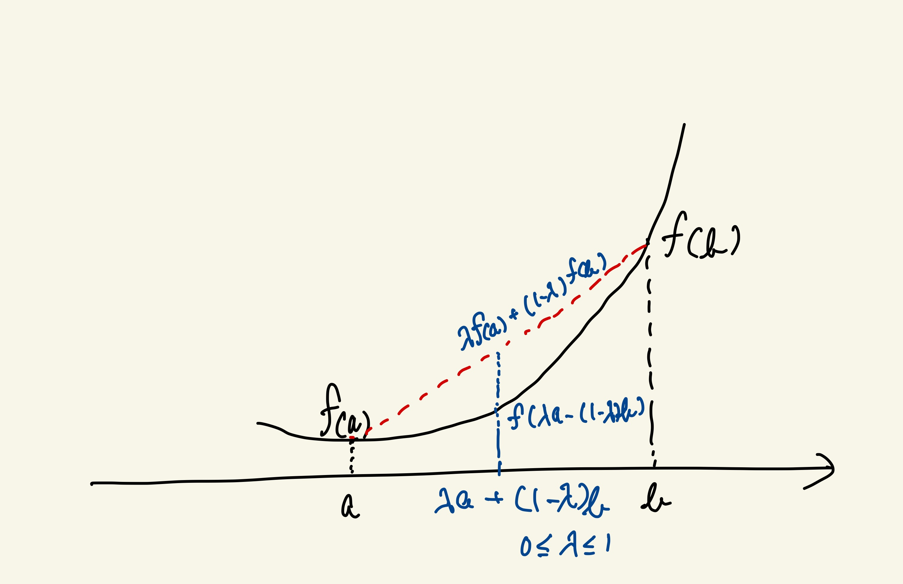

# Jensenの不等式の直感的理解

**Jensen（イェンセン、またはジェンセン）の不等式は「凸関数のグラフと、それを結ぶ直線（弦）の上下関係」を、平均という操作で言い換えた定理である。**
重みは確率ではない。**位置（どの点を見るか）を指定しているだけ**である。

## Jensenの不等式の定義

### 離散版（有限個の点）

有限個の点 $${{x_1, x_2, \ldots, x_n}}$$ と、非負で総和が1となる重み $${{p_1, p_2, \ldots, p_n}}$$ （つまり $${{p_i \ge 0}}$$、$${{\sum_{i=1}^n p_i = 1}}$$）に対して、凸関数 $${{f}}$$ は次を満たす：

$$
f\left(\sum_{i=1}^n p_i x_i\right) \le \sum_{i=1}^n p_i f(x_i)
$$

### 連続版（期待値）

確率変数 $${{X}}$$ と凸関数 $${{f}}$$ に対して：

$$
f(\mathbb{E}[X]) \le \mathbb{E}[f(X)]
$$

これは離散版の極限として理解できる。

## 凸関数の本質

関数 $${{f}}$$ が凸であるとは、**任意の2点を結ぶ直線（弦）が、グラフの上にある**ことをいう。
これは形の主張であり、増減とは無関係である。

数式：

$$
f(\lambda x+(1-\lambda)y)\le \lambda f(x)+(1-\lambda)f(y)\quad(0\le\lambda\le1)
$$

上の図は、凸関数 $${{f(x) = -\log x}}$$ において、2点 $${{(a, f(a))}}$$ と $${{(b, f(b))}}$$ を結ぶ弦（赤い点線）が、その間のグラフ（黒い曲線）より常に上にあることを示している。重み付き平均の点 $${{\lambda a + (1-\lambda)b}}$$ における関数値 $${{f(\lambda a + (1-\lambda)b)}}$$ は、弦の高さ $${{\lambda f(a) + (1-\lambda)f(b)}}$$ 以下になる。これがJensenの不等式の幾何学的な意味である。

## 二階微分による十分条件

$${{f}}$$ が区間で2回微分可能で

$$
\frac{d^2 f}{dx^2}\ge 0
$$

なら、その区間で $${{f}}$$ は凸である。

意味は明確である。
**傾きが右に行くほど増える → 直線より下に曲がる。**

## Jensenが比較している2つの量

Jensenは同じ横位置で、次の2つを比べる。

- **左辺**：グラフ上の点 $${{f(\lambda x+(1-\lambda)y)}}$$
- **右辺**：弦上の点 $${{​\lambda f(x)+(1-\lambda)f(y)}}$$

凸である限り、**グラフ ≤ 弦** が全ての $${{\lambda}}$$ で同時に成立する。

## 重みの正体

$${{\lambda}}$$ は確率ではない。
**弦のどの位置を見るかを指定する比率**である。

- $${{\lambda=0,1}}$$：端点
- $${{\lambda=\tfrac{1}{2}}}$$：弦の中点
- その他：端点間の任意の位置

したがって

$$
\lambda f(x)+(1-\lambda)f(y)
$$

は「足し算」ではなく、**弦上の高さの指定**である。

## なぜ右辺は常に上に来るのか

重要なのは、左辺と右辺が**異なるものを表している**という点である。

- **左辺** $${{f(\lambda x+(1-\lambda)y)}}$$：重み付き平均の点 $${{\lambda x+(1-\lambda)y}}$$ における**グラフ上の実際の高さ**
- **右辺** $${{​\lambda f(x)+(1-\lambda)f(y)}}$$：2つの端点 $${{(x, f(x))}}$$ と $${{(y, f(y))}}$$ を結ぶ**弦上の高さ**を、同じ横位置で測ったもの

言い換えれば、同じ横座標で：
- 左辺は「曲線上を実際に歩いて測った高さ」
- 右辺は「端点を結ぶ直線上で測った高さ」

を比較している。

凸関数の定義「グラフは弦より下にある」とは、まさにこの比較が**すべての $${{\lambda}}$$ で同時に成立する**ことを意味する。$${{\lambda}}$$ をどう選んでも、曲線は直線を突き抜けて上に行くことはない。

## 平均・期待値への拡張

2点の場合から、より多くの点の平均へと拡張できる理由を見ていこう。

### ステップ1：2点から3点へ

3点 $${{x_1, x_2, x_3}}$$ と重み $${{p_1, p_2, p_3}}$$ （$${{p_1+p_2+p_3=1}}$$）を考える。
重み付き平均は次のように**2段階の2点平均**として書ける：

$$
p_1 x_1 + p_2 x_2 + p_3 x_3 = (p_1+p_2)\left(\frac{p_1}{p_1+p_2}x_1 + \frac{p_2}{p_1+p_2}x_2\right) + p_3 x_3
$$

ここで $${{z = \frac{p_1}{p_1+p_2}x_1 + \frac{p_2}{p_1+p_2}x_2}}$$ とおくと、これは $${{x_1}}$$ と $${{x_2}}$$ の重み付き平均である。
また、$${{\frac{p_1}{p_1+p_2} + \frac{p_2}{p_1+p_2} = 1}}$$ なので、2点版のJensen不等式を適用できる：

$$
f(z) = f\left(\frac{p_1}{p_1+p_2}x_1 + \frac{p_2}{p_1+p_2}x_2\right) \le \frac{p_1}{p_1+p_2}f(x_1) + \frac{p_2}{p_1+p_2}f(x_2)
$$

次に、外側の $${{z}}$$ と $${{x_3}}$$ の重み付き平均に対して、再び2点版のJensen不等式を適用する。
$${{(p_1+p_2) + p_3 = 1}}$$ なので：

$$
\begin{align}
f(p_1 x_1 + p_2 x_2 + p_3 x_3) &= f((p_1+p_2)z + p_3 x_3) \\
&\le (p_1+p_2)f(z) + p_3 f(x_3) \\
&\le (p_1+p_2)\left(\frac{p_1}{p_1+p_2}f(x_1) + \frac{p_2}{p_1+p_2}f(x_2)\right) + p_3 f(x_3) \\
&= p_1 f(x_1) + p_2 f(x_2) + p_3 f(x_3)
\end{align}
$$

こうして、3点版が得られた。

### ステップ2：有限個の点へ

同じ考え方を繰り返すことで、任意の有限個 $${{n}}$$ 個の点に対して：

$$
f\left(\sum_{i=1}^n p_i x_i\right) \le \sum_{i=1}^n p_i f(x_i)
$$

が成り立つ。これは**2点の弦の性質を何度も適用しただけ**で、新しい原理ではない。

### ステップ3：期待値へ

確率変数 $${{X}}$$ の期待値 $${{​\mathbb{E}[X]}}$$ は、有限個の重み付き平均の極限として定義される：

$$
\mathbb{E}[X] = \lim_{n\to\infty} \sum_{i=1}^n p_i^{(n)} x_i^{(n)}
$$

連続的な確率分布の場合、積分形として：

$$
\mathbb{E}[X] = \int_{-\infty}^{\infty} x p(x) dx
$$

ここで $${{p(x)}}$$ は確率密度関数である。

凸関数は連続であるため、不等式は極限操作の下でも保存される。
したがって離散版：

$$
f(\mathbb{E}[X]) = f\left(\sum_i p_i x_i\right) \le \sum_i p_i f(x_i) = \mathbb{E}[f(X)]
$$

連続版（積分形）：

$$
f(\mathbb{E}[X]) = f\left(\int_{-\infty}^{\infty} x p(x) dx\right) \le \int_{-\infty}^{\infty} f(x) p(x) dx = \mathbb{E}[f(X)]
$$

がともに成り立つ。

## 一行で固定

> **Jensenの不等式は、凸なグラフと直線の上下関係を、平均という操作で表現したものにすぎない。**

## 注意点・例外

- 重みは **非負・総和1**（弦・凸結合の条件）
- 凸でない関数では成立しない
- 期待値版では可測性・積分可能性が前提（厳密には専門家に確認が必要）

## 出典

- Jensen, J. L. W. V. (1906), _Sur les fonctions convexes_（一次文献）
- Rockafellar, _Convex Analysis_
- Boyd & Vandenberghe, _Convex Optimization_

## 更新履歴

### 初版
- 2026-01-21: Jensenの不等式の直感的理解を追加
- Jensen（イェンセン）の読み方を明記
- 離散版と連続版の定義を追加
- 「なぜ右辺は常に上に来るのか」のセクションを改善
- 「平均・期待値への拡張」をステップごとに丁寧に説明
- ステップ1で2点から3点への式変形を詳述
- ステップ3で積分形を明記
